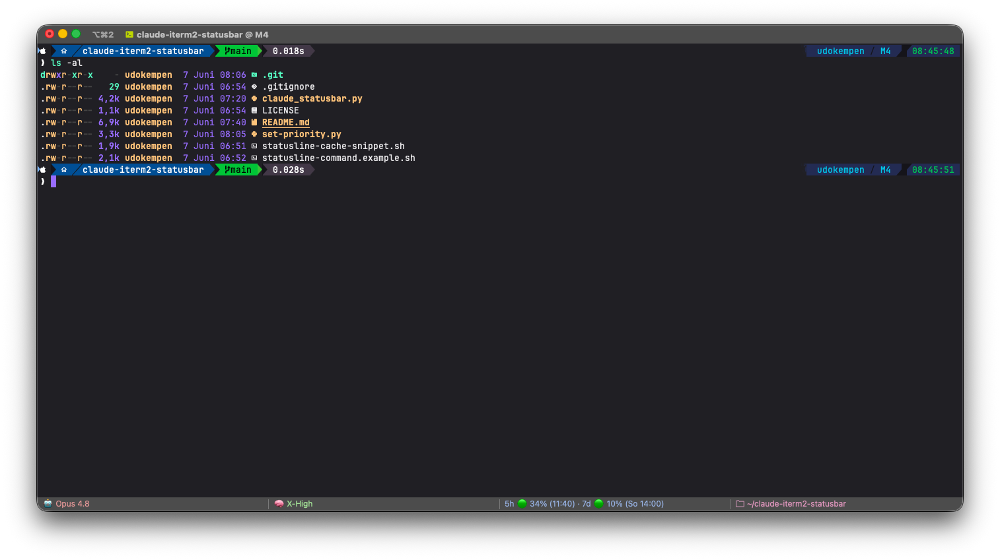
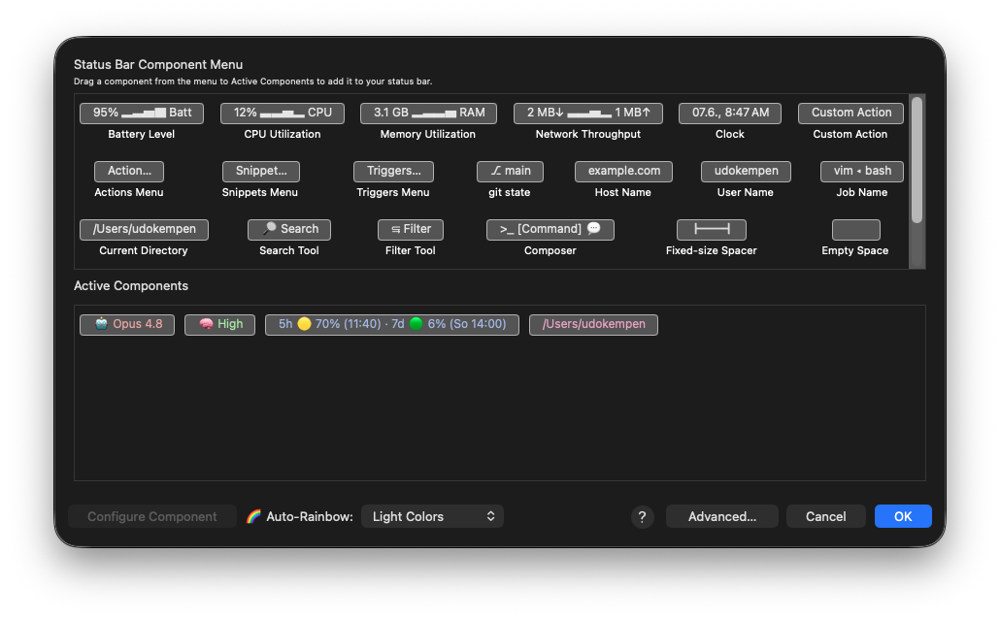

# claude-iterm2-statusbar

Show your **Claude Code** state directly in the **iTerm2 status bar** — live
rate-limit usage (5h / 7d), the active model, and the reasoning effort:



```
🤖 Opus 4.8      🧠 X-High      5h 🟢 34% (11:40) · 7d 🟢 10% (So 14:00)
```

Three small, independent components. Color comes from emoji (🟢 🟡 🔴 by usage),
so no iTerm2 color settings are required.

---

## How it works

Claude Code pipes a JSON object to your **statusLine** command on every update.
That JSON already contains the model, the effort level and your rate-limit usage.
A tiny addition to the statusLine writes those values to a cache file, and an
iTerm2 Python script reads the cache and renders the components.

```
Claude Code ──stdin JSON──▶ statusline-command.sh ──writes──▶ ~/.cache/claude/statusbar.json
                                                                      │ reads (every 30s)
                                          iTerm2 status bar ◀── claude_statusbar.py (Python API)
```

---

## Requirements

- **macOS** + **iTerm2** 3.5 or newer
- **iTerm2 Python API enabled**: iTerm2 → Settings → General → Magic →
  ✅ *Enable Python API*
- The **iTerm2 Python runtime** (iTerm2 offers to install it the first time you
  run any script) with the `iterm2` package in it
- **`jq`** on your `PATH` — `brew install jq`
- **Claude Code** with a `statusLine` configured (see Step 4). Rate-limit and
  effort fields need a reasonably recent Claude Code version; if they are absent
  the limits/effort components simply show `—`.

---

## Installation — step by step

### 1. Get the files

```sh
git clone https://github.com/wellenreiter/claude-iterm2-statusbar.git
cd claude-iterm2-statusbar
```

### 2. Install the component script into iTerm2's AutoLaunch folder

```sh
mkdir -p ~/Library/Application\ Support/iTerm2/Scripts/AutoLaunch
cp claude_statusbar.py ~/Library/Application\ Support/iTerm2/Scripts/AutoLaunch/
```

If `iterm2` isn't importable in the iTerm2 runtime, install it into that runtime:

```sh
~/Library/Application\ Support/iTerm2/iterm2env/versions/*/bin/pip install iterm2
```

### 3. Make sure the Python API is on

iTerm2 → **Settings → General → Magic → Enable Python API**. The first time a
script runs, iTerm2 asks to download its Python runtime — accept it.

### 4. Configure Claude Code (the statusLine)

The components are fed by Claude Code's **statusLine** command. You need a
statusLine that writes `~/.cache/claude/statusbar.json`.

**If you don't have a statusLine yet:**

```sh
cp statusline-command.example.sh ~/.claude/statusline-command.sh
chmod +x ~/.claude/statusline-command.sh
```

Then in `~/.claude/settings.json` add:

```json
{
  "statusLine": { "type": "command", "command": "sh ~/.claude/statusline-command.sh" }
}
```

**If you already have a statusLine:** open `statusline-cache-snippet.sh` and paste
its contents into your own statusLine script (anywhere after you read stdin into
`$input`). It only adds the cache write; it doesn't change your existing output.

> Claude Code re-reads `settings.json` on the next prompt — no full restart
> needed. Verify the cache is being written:
> ```sh
> cat ~/.cache/claude/statusbar.json
> ```

### 5. Add the three components to your status bar

1. iTerm2 → **Settings → Profiles → [your active profile] → Session →
   *Configure Status Bar***.
2. Drag **Claude Limits**, **Claude Model** and **Claude Effort** from the top
   palette down into the **Active Components** row.
3. Click **OK**.



> Not sure which profile is active? Run `echo $ITERM_PROFILE` in iTerm2.

### 6. Cold-restart iTerm2 — **don't skip this**

Quit iTerm2 completely (**⌘Q**) and reopen it. This is required (see *Gotcha 1*).
Open a Claude Code session in that window — within ~30 s the components fill in.

### 7. (Optional) Make the components win the width fight

In narrow split panes the components can get squeezed out. To give them a
priority just above the built-in components (so they stay, content-sized):

```sh
# iTerm2 rewrites its prefs on quit, so do this with it CLOSED:
# 1. Quit iTerm2 (⌘Q)
# 2. From Terminal.app (NOT iTerm2):
python3 set-priority.py
# 3. Reopen iTerm2
```

---

## What to do in Claude Code — summary

| Thing | Where |
|-------|-------|
| Enable the statusLine | `~/.claude/settings.json` → `"statusLine"` |
| The statusLine writes the cache | `~/.claude/statusline-command.sh` (snippet/example) |
| Cache the components read | `~/.cache/claude/statusbar.json` (auto-created) |
| Active profile name | `echo $ITERM_PROFILE` |

The cache only updates **while a Claude Code session is active** in that terminal —
that's expected, since the values describe your Claude usage.

---

## Troubleshooting

First stop — the script writes a boot log on every start:

```sh
cat ~/.cache/claude/claude_statusbar_boot.log
```

- Lines like `poll #1 [Claude Model] -> '🤖 Opus 4.8'` repeating every ~30 s mean
  iTerm2 is bound and rendering. If you still see nothing, it's a width problem
  (below).
- Only `registered ...` with **no** `poll ...` line → registered but not bound to
  a visible slot → *Gotcha 1*.

### The four gotchas (each cost real time to find)

**1. Nothing shows until you cold-restart.**
iTerm2 binds a script's component to a status-bar slot **at registration time**.
If the script is already running and you *then* add the component to the profile,
it stays blank. Fix: add the components, then **fully quit + reopen iTerm2** so the
AutoLaunch script registers *after* the slots exist.
(The config dialog shows the component's hardcoded **exemplar**, e.g. `42% Sunday`,
not live data — so the dialog can't tell you whether it actually works. Only the
real bar can.)

**2. A wide value flashes once, then disappears.**
A slot defaults to `minwidth=0` + low compression resistance, so a wide string is
squeezed to width 0 on reflow. Keep rendered strings short (that's why the format
is compact). See Step 7 / `set-priority.py` to protect them.

**3. All three components show the same value.**
iTerm2 identifies an RPC by the callback's `__name__`; if several components share
a callback name they collide and all render the first one's value. Already fixed in
`claude_statusbar.py` (each callback gets a unique name) — only relevant if you fork
the rendering.

**4. Components are super-wide and squeeze CPU/RAM out.**
Priority too high. `set-priority.py` is balanced (priority 6 / compression 1) so the
components size to their content like the built-in ones. Re-run it (Step 7).

### The macOS "iTerm.app wants to access data from other apps" prompt

This appears once per iTerm2 cold start and is **not** caused by this project.
Claude Code reads the Claude **desktop** app's data
(`~/Library/Application Support/Claude/`) at startup; iTerm2 is the parent process,
so macOS names iTerm in the dialog. It's harmless — Claude Code works whether you
allow or deny. To stop it for good, give **iTerm2 Full Disk Access**
(System Settings → Privacy & Security → Full Disk Access), or just click *Allow*.

---

## Customize

All rendering is in `claude_statusbar.py`:

- **Thresholds / colors** — `circle()` (default 🟢 <70 %, 🟡 70–89 %, 🔴 ≥90 %)
- **Effort labels** — `EFFORT_LABELS` (`xhigh → "X-High"`, …)
- **Format** — `render_limits()` / `render_model()` / `render_effort()`. Keep it
  short (Gotcha 2). After editing, cold-restart iTerm2 to re-register.

---

## Files

| File | Purpose |
|------|---------|
| `claude_statusbar.py` | iTerm2 AutoLaunch script — registers the 3 components |
| `statusline-cache-snippet.sh` | Paste into an existing statusLine to write the cache |
| `statusline-command.example.sh` | Complete minimal statusLine if you don't have one |
| `set-priority.py` | Balance the components' width/priority (run with iTerm2 closed) |

## License

MIT — see [LICENSE](LICENSE).
